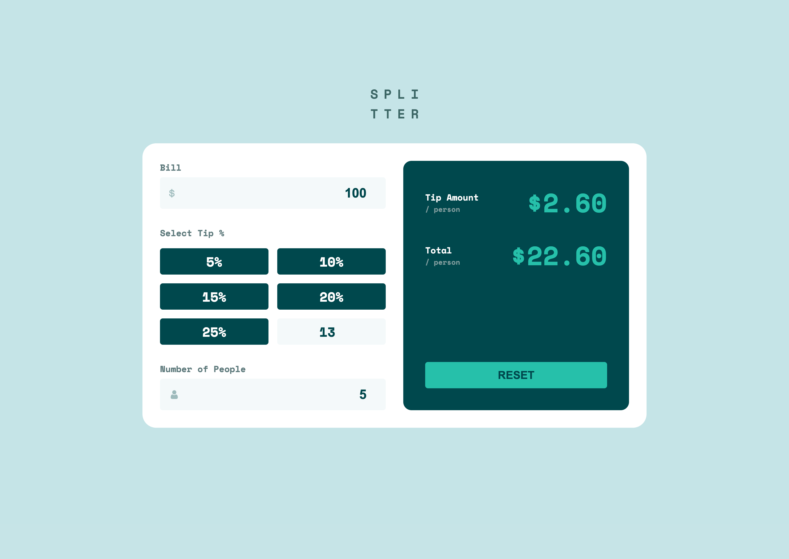

# Frontend Mentor - Tip calculator app solution

This is a solution to the [Tip calculator app challenge on Frontend Mentor](https://www.frontendmentor.io/challenges/tip-calculator-app-ugJNGbJUX). Frontend Mentor challenges help you improve your coding skills by building realistic projects.

## Table of contents

- [Overview](#overview)
  - [The challenge](#the-challenge)
  - [Screenshot](#screenshot)
  - [Links](#links)
- [My process](#my-process)
  - [Built with](#built-with)
  - [What I learned](#what-i-learned)
  - [Continued development](#continued-development)
- [Author](#author)

## Overview

### The challenge

Users should be able to:

- View the optimal layout for the app depending on their device's screen size
- See hover states for all interactive elements on the page
- Calculate the correct tip and total cost of the bill per person

### Screenshot



### Links

- Solution URL: [Github](https://github.com/delroscol98/Tip-Calculator-V2)
- Live Site URL: [Netlify](https://main--incomparable-cajeta-e2b5d8.netlify.app/)

## My process

### Built with

- Semantic HTML5 markup
- CSS custom properties
- Flexbox
- CSS Grid
- Mobile-first workflow
- [React](https://reactjs.org/) - JS library

### What I learned

Below is the formula I used to complete the calculations

```js
const tipAmount =
  numPeople > 0
    ? percentage !== 0
      ? (bill * percentage) / 100 / numPeople
      : (bill * customPercentage) / 100 / numPeople
    : 0;

const total =
  numPeople > 0
    ? percentage !== 0 && numPeople > 0
      ? (bill + (bill * percentage) / 100) / numPeople
      : (bill + (bill * customPercentage) / 100) / numPeople
    : 0;
```

### Continued development

This project was for more practice with React Hooks.

## Author

- Frontend Mentor - [@delroscol98](https://www.frontendmentor.io/profile/delroscol98)
